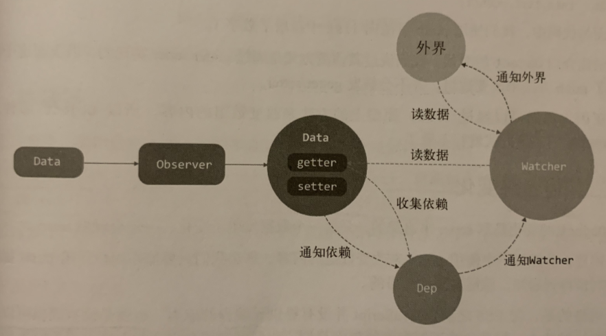

## 一、变化侦测

变化侦测有两种类型：”推“和”拉“。

“拉”指的是当状态发生变化，框架不知道哪个状态变了，需要通过暴力对比去找出变化的 DOM 节点。React 和 Angular 就是这种侦测方式，分别采用虚拟 DOM 技术和脏检查。

”推“指的是指的是状态变化能立马知道，Vue 就是属于这种，因此 Vue 能进行更细粒度的更新。

💡 细粒度指的是假如一个状态绑定着好多个依赖，每个依赖代表一个DOM节点，那么当这个状态发生改变时，向这个状态的所有依赖发送通知，让它们进行DOM更新操作。

粒度太细，当状态多的情况下，依赖追踪在内存上的开销会很大。所以 Vue2.0 引入了虚拟 DOM，将粒度调整为中等粒度，即一个状态所绑定的依赖不再是一个 DOM 节点，而是一个组件。状态的变化会先通知到组件，组件内部再使用虚拟 DOM 进行比对。

## 二、如何追踪变化

变化侦测有两种方式：Object.defineProperty 和 ES6 的 Proxy

下面定义一个响应式的方法：

```jsx
function defineReactive(data, key, val) {
	Obejct.defineProperty(data, key, {
		enumerable: true,
		configurable: true,
		get: function() {
			return val
		},
		set: function(newVal) {
			if(val === newVal) return
			val = newVal
		}
	})
}
```

## 三、如何收集依赖

在 getter 中收集依赖，在 setter 中触发依赖。

## 四、依赖收集在哪里

每个 key 都有一个数组，用来存储当前 key 的依赖。假设有一个依赖，存储在 [window.target](http://window.target) 上，

```jsx
let dep = [] // 新增
function defineReactive(data, key, val) {
	Obejct.defineProperty(data, key, {
		enumerable: true,
		configurable: true,
		get: function() {
			dep.push(window.target) // 新增，存储依赖
			return val
		},
		set: function(newVal) {
			if(val === newVal) return
		  // 新增，触发依赖
			for(let i = 0; i < dep.length; i++){
				dep[i](newVal, val)
			}
			val = newVal
		}
	})
}
```

我们可以封装一个 Dep 类来管理依赖，实现依赖收集、删除、向依赖发送通知：

```jsx
export default class Dep {
	constructor() {
    this.subs = []
	}

  addSub(sub) {
    this.subs.push(sub)
  }

  removeSub(sub){
    remove(this.subs, sub)
  }

  depend() {
    if(window.target) {
      this.addSub(window.target)
    }
  }

  notify() {
    const subs = this.subs.slice()
    for(let i = 0; i < subs.length; i++) {
      subs[i].update()
    }
  }
}

function remove(arr, item) {
  if(!!arr.length) {
    const index = arr.indexOf(item)
    if(index > -1) {
      return arr.splice(index, 1)
    }
  }
}
```

```jsx
function defineReactive(data, key, val) {
	let dep = new Dep() // 修改
	Obejct.defineProperty(data, key, {
		enumerable: true,
		configurable: true,
		get: function() {
			dep.depend() // 修改，存储依赖
			return val
		},
		set: function(newVal) {
			if(val === newVal) return
			dep.notify() // 修改
			val = newVal
		}
	})
}
```

## 五、依赖是谁

上面我们收集的依赖是 window.target，其实就是当属性发生变化后要通知的对象，我们称为依赖。

依赖也可能有很多种形式，模板、用户写的一个watch...所以需要一个集中处理这些情况的类。

我们在依赖收集阶段只收集这个类的实例，通知也只通知它，然后它再去通知其他地方。它叫Watcher！！！

## 六、什么是 Watcher

类似于一个中介，数据发生变化时通知它，它再通知其他地方。

## 七、递归侦测所有 key

为了侦测数据中的所有属性（包括子属性），需要封装一个 Observer 类。

这个类的作用是将一个数据内的所有属性（包括子属性）都转换成 getter/setter 的形式，来收集属性的依赖，并且当属性发生变化时会通知这些依赖。

```jsx
export class Observer {
  constructor(value) {
    this.value = value

    if(!Array.isArray(value)){
      this.walk(value)
    }
  }

  walk(obj) {
    const keys = Object.keys(obj) 
    for(let i = 0; i < keys.length; i++){
      defineReactive(obj, keys[i], obj[keys[i]])
    }
  }
}

function defineReactive(data, key, val) {
	//	新增，递归子属性
	if(typeof val === 'object') {
		new Observer(val)
	}
  let dep = new Dep()
	Obejct.defineProperty(data, key, {
		enumerable: true,
		configurable: true,
		get: function() {
			dep.depend()
			return val
		},
		set: function(newVal) {
			if(val === newVal) return
			dep.notify()
			val = newVal
		}
	})
}
```

## 八、关于 Object 的问题

向 obj 对象新增属性或者删除属性，Vue.js 无法侦测到这个变化，所以不会向依赖发送通知。

💡 getter/setter 只能追踪一个数据是否被修改，无法追踪新增属性和删除属性。因为 js 没有提供元编程的能力。所以 Vue 提供了两个 API —— vm.$set 和 vm.$delete。

## 九、总结

1. Object 可以通过 defineProperty 将属性转换成 getter/setter 的形式来追踪变化，读取时触发 getter，修改数据时触发 setter；
2. 我们需要在 getter 中收集有哪些依赖使用了该数据，当 setter 触发时，去通知 getter 中收集的依赖数据发生了变化；
3. 我们创建了 Dep 来收集依赖、删除依赖和向依赖发送消息等；
4. 依赖其实就是 Watcher，只有 Watcher 触发的 getter 才会收集依赖，哪个 Watcher 触发了 getter，就把哪个 Watcher 收集到 Dep 中，当数据发生变化时，会循环依赖列表，把所有 Watcher 通知一遍；
5. Watcher 的原理是先把自己设置到全局唯一的指定位置（例如 window.target），然后读取数据。因为读取了数据，所以会触发这个数据的 getter。接着在 getter 中就会从全局唯一的那个位置读取当前正在读取数据的 Watcher，并把这个 Watcher 收集到 Dep 中去。通过这种方式， Watcher 可以主动订阅任意一个数据的变化；
6. 我们创建了一个 Observer 类，把一个 object 中的所有数据都转换成响应式的。




- Data 通过 Observer 转换成了 getter/setter 的形式来追踪变化。
- 当外界通过 Watcher 读取数据时，会触发 getter 从而将 Watcher 添加到依赖 Dep 中。
- 当数据发生变化时，会触发 setter，从而向 Dep 中的依赖发送通知。
- Watcher 接收到通知后，会向外界发送通知，变化通知到外界后触发视图更新，也有可能触发用户的某个回调函数。