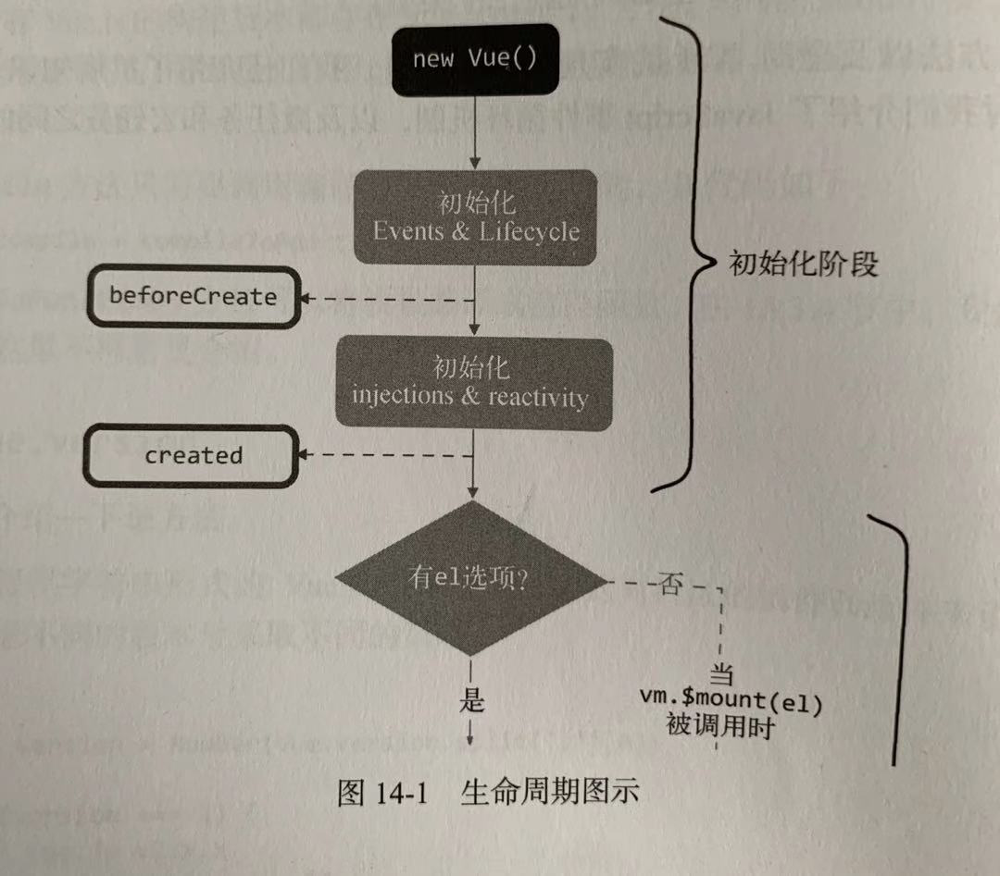
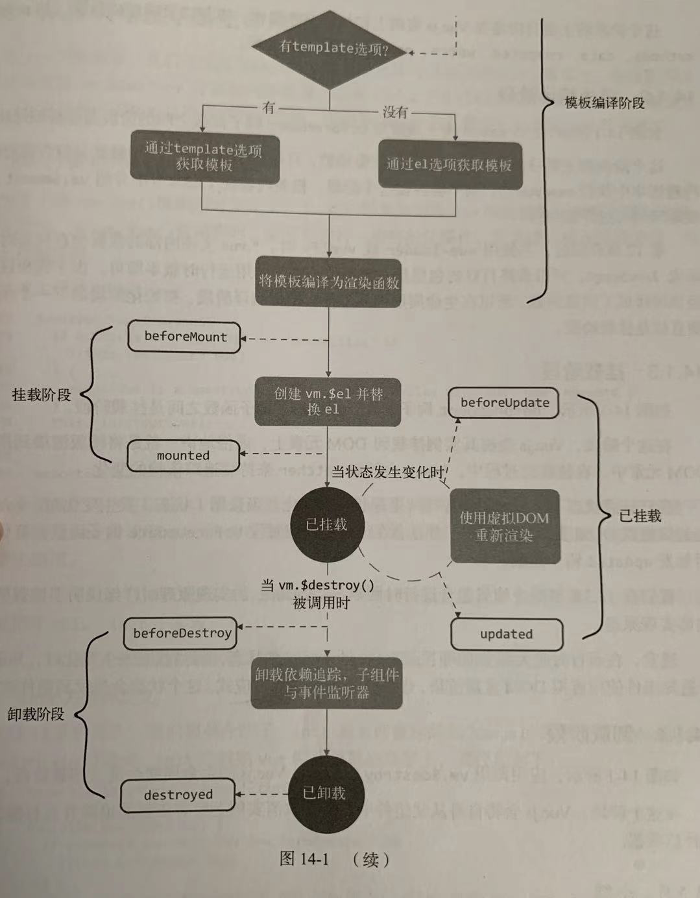
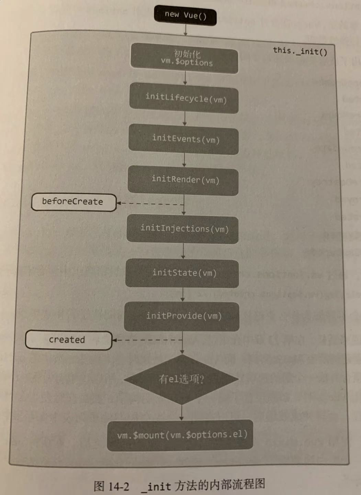
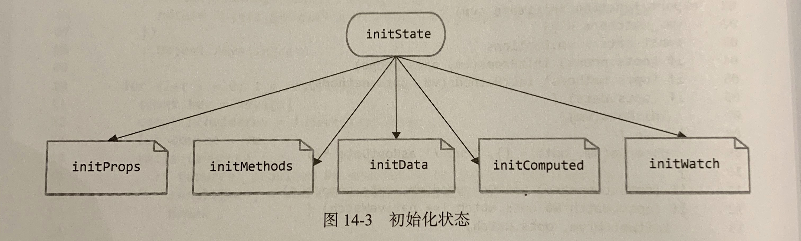
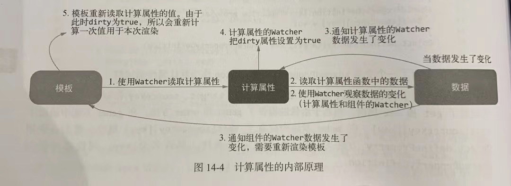

## 一、生命周期图示

每个 Vue 实例在创建的时候都要经过一系列初始化，例如设置数据监听、编译模板、将实例挂载到 DOM 并在数据变化时更新 DOM 等。同时也会运行一些生命周期钩子函数，给我们在不同阶段添加自定义代码。





### 1、初始化接阶段

定义：new Vue( ) 到 created 之间的阶段。

目的：在 Vue 实例上初始化一些属性、事件以及响应式数据，如 props、methods、data、computed、watch、provide 和 inject 等。

### 2、模板编译阶段

定义：在 created 与 beforeMount 之间的阶段。

目的：将模板编译为渲染函数，只存在于完整版中。如果在只包含运行时的构建版本中执行 new Vue( ) 则不会存在这个阶段。


> 当使用 vue-loader 在构建时将模板文件预编译成 JavaScript，则打包成的 Vue.js 代码包是不需要编译器的。


### 3、挂载阶段

定义：beforeMount 到 mounted 之间的阶段。

结果：Vue.js 会将其实例挂载到 DOM 元素上。

在挂载的过程中，Vue.js 会开启 Watcher 来持续追踪依赖的变化。在已挂载状态下， Vue.js 会持续追踪状态的变化。当状态发生变化时，Watcher 会通知虚拟 DOM 重新渲染视图，并且会在渲染视图前触发 beforeUpdate 钩子函数，渲染完毕后触发 updated 钩子函数。

### 4、卸载阶段

定义：应用调用 vm.$destroy 方法后， Vue.js 的生命周期会进入卸载阶段。

结果：在这个阶段，Vue.js 会将自身从父组件中删除，取消实例上所有依赖的追踪并且移除所有的事件监听器。

## 二、从源码角度了解生命周期

### new Vue( ) 被调用时发生了什么

当 new Vue( ) 被调用时，会首先进行一些初始化操作，然后进入模板编译阶段，最后进入挂载阶段。

```jsx
import { initMixin } from './init'
function Vue(options) {
	if(process.env.NODE_ENV !== 'production' && !(this instanceof Vue)) {
		warn('Vue is a constructor and should be called with `new` keyword')
	}
	this._init(options)
}
initMixin(Vue)
export default Vue
```

通过调用 initMixin 函数向 Vue 的构造函数的原型中挂载一些方法。

```jsx
exprt function initMixin(Vue) {
	Vue.prototype._init = function(options) {
		vm.$options = mergeOptions(
			resolveConstructorOptions(vm.constructor),
			options || {},
			vm
		)
		initLifecycle(vm)
		initEvents(vm)
		initRender(vm)
		callHook(vm, 'beforeCreate')
		initInjections(vm) // 在 data/props 前初始化 inject
		initState(vm)
		initprovide(vm) // 在 data/props 后初始化 provide
		callHook(vm, 'created')
	}
	if(vm.$options.el) {
		vm.$mount(vm.$options.el)
	}
}
```

在执行初始化流程之前，实例上挂载了 $options 属性，此属性包括用户传递的 options 选项、当前构造函数的 options 属性及其父级实例构造函数的 options 属性。


> resolveConstructorOptions 函数的作用就是获取当前实例中构造函数的 options 选项及其父级的构造函数的 options。


整体调用顺序如下：



### callHook 函数的内部原理

Vue.js 通过 callHook 函数来触发用户设置的生命周期钩子，而用户设置的生命周期钩子会在执行 new Vue( ) 时通过参数传递给 Vue.js。

所有生命周期钩子如下：

beforeCreate、created

beforeMount、mounted

beforeUpdate、updated

beforeDestroy、destroyed

activated、deactivated

errorCaptured

Vue.js 在合并 options 的过程中会找出 options 中所有 key 是钩子函数的名字，并将它转化为数组。


> 为何钩子函数要转化为数组？
Vue.mixin 和用户在实例化 Vue.js 时，如果设置了同一个生命周期钩子，那么在触发生命周期时，需要同时触发这两个函数。


```jsx
function callHook(vm, hook) {
	const handlers = vm.$options[hook]
	if(handlers) {
		for(let i = 0,j = handlers.length; i < j; i++) {
			try {
				handlers[i].call(vm)
			} catch(e) {
				handleError(e, vm, `${hook} hook`)
			}
		}
	}
}
```

handleError 会依次执行父组件的 errorCaptured 钩子函数与全局的 config.errorHandler，这也是为什么生命周期钩子 errorCaptured 可以捕获子孙组件的错误。

## 三、errorCaptured 与错误处理

errorCaptured 钩子函数的租用是捕获来自子孙组件的错误，接收三个参数：错误对象、发生错误的组件实例以及一个包含错误来源信息的字符串。此钩子函数可以返回 false，阻止该错误继续向上传播。

传播规则如下：

- 默认情况下，如果全局的 config.errorHandle 被定义，那么所有的错误都会发送给它，那么错误可以统一在一个位置报告给分析服务。
- 如果一个组件继承的链路或其父级从属链路中存在多个 errorCaptured，则它们将会被相同的错误逐个唤起。
- 如果 errorCaptured 自身抛出了一个错误，则这个新错误和原本被捕获的错误都会发送给全局的 config.errorCaptured。
- 一个 errorCaptured 钩子函数可以返回 false 来阻止错误继续向上传播。

Vue.js 在执行用户代码时，会用 try...catch 来捕获所有抛出的错误，然后会用 handleError 函数来处理这些错误。该函数会依次触发父组件链路上的每一个父组件中定义的 errorCaptured 钩子函数。

也就是说，错误的传播规则是在 handleError 函数中实现的。

## 四、初始化实例属性

初始化实例属性是第一步，需要实例化的属性有 $ 开头的外部属性（如 vm.$parent），也有 _ 开头的内部属性。

Vue.js 通过 initLifecycle 函数向实例中挂载属性：

```jsx
export function initLifecycle (vm: Component) {
  const options = vm.$options

  // locate first non-abstract parent
  let parent = options.parent
  if (parent && !options.abstract) {
    while (parent.$options.abstract && parent.$parent) {
      parent = parent.$parent
    }
    parent.$children.push(vm)
  }

  vm.$parent = parent
  vm.$root = parent ? parent.$root : vm

  vm.$children = []
  vm.$refs = {}

  vm._watcher = null
  vm._inactive = null
  vm._directInactive = false
  vm._isMounted = false
  vm._isDestroyed = false
  vm._isBeingDestroyed = false
}
```

- vm.$parent 属性
    
    找到第一个非抽象类类型的父级，赋值给 vm.$parent
    
- vm.$children
    
    会包含当前实例的直接子组件，该属性的值是从子组件主动添加到父组件中的。
    
- vm.$root
    
    表示当前组件树的根 Vue.js 实例。
    
    实现：如果当前组件没有父组件，那么它自己就是根组件；而它的子组件的 vm.$root 属性是沿用父级的 $root。
    

## 五、初始化事件

概念：是指将父组件在模板中使用的 v-on 注册的事件添加到子组件的事件系统中。

在模板编译阶段，会将整个模板编译成渲染函数，就是一些嵌套在一起的创建元素节点的函数。当渲染流程启动时，渲染函数会被执行并生成一份 vnode，随后虚拟 DOM 会使用 vnode 进行对比与渲染。

在这个过程中会创建一些元素，此时会判断当前这个标签是真的标签还是组件：

- 如果是组件标签，那么会将子组件实例化并传递一些参数
    
    参数中就包括父组件在模板中使用 v-on 注册在子组件标签上的事件
    
- 如果是平台标签，则创建元素并插入到 DOM 中
    
    同时会将标签上使用 v-on 注册的事件注册到浏览器事件中
    

简单来说：

- 如果 v-on 写在组件标签上，那么这个事件会注册到子组件 Vue.js 事件系统中；
- 如果 v-on 卸载平台标签上，那么事件会被注册到浏览器事件中。


> 在初始化 Vue.js 实例时，有可能会接收父组件向子组件注册的事件。而子组件自身在模板中注册的事件，只有在渲染的时候才会根据虚拟 DOM 的对比结果来确定是注册事件还是解绑事件。
所以在实例初始化阶段，被初始化的事件指的是父组件在模板中使用 v-on 监听子组件内触发的事件。


```jsx
export function initEvents (vm: Component) {
  vm._events = Object.create(null)
  vm._hasHookEvent = false
  // init parent attached events
  const listeners = vm.$options._parentListeners
  if (listeners) {
    updateComponentListeners(vm, listeners)
  }
}
```

在 vm 上新增 _events 属性并初始化为空对象，用来存储事件。

模板编译阶段，当模板解析到组件标签时，会实例化子组件，同时将标签上注册的事件解析成 object 并通过参数传递给子组件。

所以当子组件被实例化时，可以再参数中获取父组件向自己注册的事件，这些事件保存在 vm.$options._parentListeners 中。

```jsx
let target: any

function add (event, fn) {
  target.$on(event, fn)
}

function remove (event, fn) {
  target.$off(event, fn)
}

export function updateComponentListeners (
  vm: Component,
  listeners: Object,
  oldListeners: ?Object
) {
  target = vm
  updateListeners(listeners, oldListeners || {}, add, remove, createOnceHandler, vm)
  target = undefined
}
```

封装了 add 和 remove 用来新增和删除事件。updateListeners 用来对比 listeners 和 oldListeners 的不同，如果 listeners 对象中存在某个 key 在 oldListeners 中不存在，那么说明这个事件是需要新增的；如果 oldListeners 中存在某些 key 在 listeners 中不存在，那么说明这个事件是需要移除的。

```jsx
export function updateListeners (
  on: Object,
  oldOn: Object,
  add: Function,
  remove: Function,
  createOnceHandler: Function,
  vm: Component
) {
  let name, def, cur, old, event
  for (name in on) {
    def = cur = on[name]
    old = oldOn[name]
    event = normalizeEvent(name)
    /* istanbul ignore if */
    if (__WEEX__ && isPlainObject(def)) {
      cur = def.handler
      event.params = def.params
    }
    if (isUndef(cur)) {
      process.env.NODE_ENV !== 'production' && warn(
        `Invalid handler for event "${event.name}": got ` + String(cur),
        vm
      )
    } else if (isUndef(old)) {
      if (isUndef(cur.fns)) {
        cur = on[name] = createFnInvoker(cur, vm)
      }
      if (isTrue(event.once)) {
        cur = on[name] = createOnceHandler(event.name, cur, event.capture)
      }
      add(event.name, cur, event.capture, event.passive, event.params)
    } else if (cur !== old) {
      old.fns = cur
      on[name] = old
    }
  }
  for (name in oldOn) {
    if (isUndef(on[name])) {
      event = normalizeEvent(name)
      remove(event.name, oldOn[name], event.capture)
    }
  }
}
```

代码共有两部分：

- 第一部分是循环 on
    - 判断事件名对应的值是否是 undefined 或 null，如果是，触发警告。
    - 判断该事件名在 oldOn 中是否存在，不存在则调用 add 注册。
    - 如果事件名在 on 和 oldOn 中都存在，但它们并不相同，则将事件回调替换成 on 中的回调，并且把 on 中的回调引用指向真实的事件系统中注册的事件，也就是 oldOn 中对应的事件。
- 第二部分是循环 oldOn
    
    主要判断哪些事件在 on 中不存在，则移除。
    

**normalizeEvent 的作用是：**

Vue.js 的模板支持事件修饰符，例如 capture、once 和 passive 等。如果在模板中注册事件时使用了修饰符，那么在模板编译阶段解析成标签上的属性时，会将这些修饰符改成对应的符号加载事件名的前面。

例如：

```jsx
<child v-on:increment.once="a"></child>
```

此时 vm.$options._parentlisteners 为：

```jsx
{~increment: function() {}}
```

所以，normalizeEvent 的作用就是将事件修饰符解析出来。

## 六、初始化 inject

### 1、provie/inject 的使用方式

允许祖先组件向其所有子孙后代注入依赖，并在其上下游关系成立的时间里始终生效。


> 主要为高阶插件/组件库提供用例，不推荐用于程序代码中。


### 2、inject 的内部原理

TODO

## 七、初始化状态

```jsx
export function initState (vm: Component) {
  vm._watchers = []
  const opts = vm.$options
  if (opts.props) initProps(vm, opts.props)
  if (opts.methods) initMethods(vm, opts.methods)
  if (opts.data) {
    initData(vm)
  } else {
    observe(vm._data = {}, true /* asRootData */)
  }
  if (opts.computed) initComputed(vm, opts.computed)
  if (opts.watch && opts.watch !== nativeWatch) {
    initWatch(vm, opts.watch)
  }
}
```

首先在 vm 上新增一个属性 _watchers，用来保存当前组件中所有的 watcher 实例。无论是使用 vm.$watch 注册的 watcher 实例还是使用 watch 选项添加的 watcher 实例，都会添加到 vm._watchers 中；

接下来判断 vm.$options 中是否存在 props 属性，如果存在，初始化；

然后判断 vm.$options 中是否存在 methods 属性，如果存在，初始化；

接着判断 vm.$options 中是否存在 data 属性，如果存在，初始化，否则直接使用 observer 函数观察空对象。


> observer 函数是将数据转换为响应式的。


接着判断 vm.$options 中是否存在 computed 属性，如果存在，初始化；

最后判断 vm.$options 中是否存在 watch 属性；如果存在，初始化。


> 用户在实例化 Vue.js 的时候使用了哪些状态，哪些状态就需要被初始化。




### 1、初始化 props

props 实现原理：父组件提供数据，子组件通过 props 字段选择自己需要哪些内容，Vue.js 内部通过子组件的 props 选项将需要的数据筛选出来之后添加到子组件的上下文中。

**Vue.js 组件系统的运作原理：**

Vue.js 中的所有组件都是 Vue.js 实例，组件在进行模板解析时，会将标签上的属性解析成数据，最终生成渲染函数。当函数被执行时，会生成真实的 DOM 节点并渲染到视图中。

在这个过程中，如果某个节点是组件节点，那么在虚拟 DOM 渲染的过程中，会将组件实例化，这会将模板解析时从标签属性上解析出的数据当做参数传递给子组件，其中就包含 props 数据。

**有两个步骤：**

1. **规格化 props**
    
    子组件被实例化时，会先对 props 进行规格化处理，处理为对象的格式。
    
    
    > props 可以通过数组指定需要哪些属性，但在 Vue.js 内部，数组格式的 props 将被规格化成对象格式。
    
    
    
    ```jsx
    function normalizeProps (options: Object, vm: ?Component) {
      const props = options.props
      if (!props) return
      const res = {}
      let i, val, name
      if (Array.isArray(props)) {
        i = props.length
        while (i--) {
          val = props[i]
          if (typeof val === 'string') {
            name = camelize(val)
            res[name] = { type: null }
          } else if (process.env.NODE_ENV !== 'production') {
            warn('props must be strings when using array syntax.')
          }
        }
      } else if (isPlainObject(props)) {
        for (const key in props) {
          val = props[key]
          name = camelize(key)
          res[name] = isPlainObject(val)
            ? val
            : { type: val }
        }
      } else if (process.env.NODE_ENV !== 'production') {
        warn(
          `Invalid value for option "props": expected an Array or an Object, ` +
          `but got ${toRawType(props)}.`,
          vm
        )
      }
      options.props = res
    }
    ```
    
    - 首先检查是否有 props，有才规格化。
    - 先检查 props 是否为数组：
        - 如果不是继续检查是否为对象类型：
            - 如果不是，警告。
            - 如果是，for...in 循环对象得到 key 和 val，判断 val 是否为对象类型：
                - 如果是，则在 res 上设置 key 为名的属性，值为 val。
                - 如果不是，则在 res 上设置 key 为名的属性，值为 {type: val}
        - 如果是，while 循环数组每一项判断 props 的名称的类型是否是 String 类型
            - 如果不是，警告。
            - 如果是，将 props 驼峰化。随后将 props 名当做属性，设置到 res 中，值为 { type: null }。
                
                
                > 我们在组件中如果使用 user-name 传递数据，在 props 选项中要使用 userName 获取数据。
                
                
                
2. **初始化 props**
    
    原理：通过规格化之后的 props 从其父组件传入的 props 数据中后从使用 new 创建的实例时传入的 propsData 参数中，筛选出需要的数据保存在 vm._props 中，然后在 vm 上设置一个代理，实现通过 vm.x 访问 vm._props.x 的目的。
    
    初始化 props 的方法如下：
    
    ```jsx
    function initProps (vm: Component, propsOptions: Object) {
      const propsData = vm.$options.propsData || {}
      const props = vm._props = {}
      // cache prop keys so that future props updates can iterate using Array
      // instead of dynamic object key enumeration.
      const keys = vm.$options._propKeys = []
      const isRoot = !vm.$parent
      // root instance props should be converted
      if (!isRoot) {
        toggleObserving(false)
      }
      for (const key in propsOptions) {
        keys.push(key)
        const value = validateProp(key, propsOptions, propsData, vm)
        /* istanbul ignore else */
        if (process.env.NODE_ENV !== 'production') {
          const hyphenatedKey = hyphenate(key)
          if (isReservedAttribute(hyphenatedKey) ||
              config.isReservedAttr(hyphenatedKey)) {
            warn(
              `"${hyphenatedKey}" is a reserved attribute and cannot be used as component prop.`,
              vm
            )
          }
          defineReactive(props, key, value, () => {
            if (!isRoot && !isUpdatingChildComponent) {
              warn(
                `Avoid mutating a prop directly since the value will be ` +
                `overwritten whenever the parent component re-renders. ` +
                `Instead, use a data or computed property based on the prop's ` +
                `value. Prop being mutated: "${key}"`,
                vm
              )
            }
          })
        } else {
          defineReactive(props, key, value)
        }
        // static props are already proxied on the component's prototype
        // during Vue.extend(). We only need to proxy props defined at
        // instantiation here.
        if (!(key in vm)) {
          proxy(vm, `_props`, key)
        }
      }
      toggleObserving(true)
    }
    ```
    
    - 接收两个参数，Vue.js 实例和规格化之后的 props
    - 声明四个变量：
        - propsData：通过父组件传入或用户通过 propsData 传入的真实 props 数据。
        - props：是指向 vm._props 的指针。
        - keys：指向 vm.$options._propsKeys 的指针，用来缓存 props 对象中的 key，将来更新 props 时只需要遍历 vm.$options._propKeys 数组即可得到所有的 props 的key。
        - isRoot：判断当前组件是否是根组件。
    - 接下来，判断当前组件是否是根组件：
        - 如果不是，不需要将 props 数据转换成响应式的
        - 然后循环 propsOptions，在循环体中先将 key 添加到 keys 中，然后调用 validateProp 函数将得到的 props 数据通过 defineReactive 函数设置到 vm._props 中。
    - 最后判断这饿 key 在 vm 中是否存在，如果不存在，则调用 proxy，在 vm 上设置一个以 key 为属性的代理，当使用 vm[key] 访问数据时，其实是访问 vm._props[key]
    
    validateProp 是如何获取 props 内容的？
    
    ```jsx
    export function validateProp (
      key: string,
      propOptions: Object,
      propsData: Object,
      vm?: Component
    ): any {
      const prop = propOptions[key]
      const absent = !hasOwn(propsData, key)
      let value = propsData[key]
      // boolean casting
      const booleanIndex = getTypeIndex(Boolean, prop.type)
      if (booleanIndex > -1) {
        if (absent && !hasOwn(prop, 'default')) {
          value = false
        } else if (value === '' || value === hyphenate(key)) {
          // only cast empty string / same name to boolean if
          // boolean has higher priority
          const stringIndex = getTypeIndex(String, prop.type)
          if (stringIndex < 0 || booleanIndex < stringIndex) {
            value = true
          }
        }
      }
      // check default value
      if (value === undefined) {
        value = getPropDefaultValue(vm, prop, key)
        // since the default value is a fresh copy,
        // make sure to observe it.
        const prevShouldObserve = shouldObserve
        toggleObserving(true)
        observe(value)
        toggleObserving(prevShouldObserve)
      }
      if (
        process.env.NODE_ENV !== 'production' &&
        // skip validation for weex recycle-list child component props
        !(__WEEX__ && isObject(value) && ('@binding' in value))
      ) {
        assertProp(prop, key, value, vm, absent)
      }
      return value
    }
    ```
    
    - 接收4个参数：
        - key：propsOptions 中的属性名
        - propOptions：子组件用户设置的 props 选项
        - propsData：父组件或用户提供的 props 数据
        - vm：实例上下文
    - 声明3个变量：
        - prop：保存的是当前这个 key 的 prop 选项
        - absent：表示当前的 key 在用户提供的 props 选项中是否存在
        - value：表示使用当前这个 key 在用户提供的 props 选项中获取的数据
    - 首先，解决布尔类型 prop 的特殊情况：
        - 先使用 booleanIndex 判断 prop 的 type 是否是布尔值：
            - 如果是，处理两种特殊的场景。
                - 一种是 key 不存在，就是父组件或用户没有提供这个数据，并且 props 选项中也没有设置默认值，这个时候需要将 value 设置成 false；
                - key 存在，但 value 是空字符串或者 value 和 key 相等，这时候需要将 value 设置成 true；
                    
                    
                    > 相等的情况：a='a' 或者 userName='user-name'
                    
                    
                    
                    也就是说，下面的使用方式下，子组件的 prop 都将设置成 true
                    
                    ```jsx
                    <child name></child>
                    <child name="name"></child>
                    <child userName="user-name"></child>
                    ```
                    
                    
                    > hyphenate 函数会将 key 进行驼峰转换，也就是说 userName 会转换为 user-name
                    
                    
                    
    - 如果不是布尔值，其他类型的 prop 只需要处理一种情况，并不需要进行额外的处理。那就是如果子组件通过 props 选项设置的 key 在 props 数据中并不存在，这时 props 如果提供了默认值， 则需要使用它，并将默认值转换成响应式数据。

---

### 2、初始化 methods

只需要循环选项中的 methods 对象，并将每个属性依次挂载到 vm 上即可。

```jsx
function initMethods (vm: Component, methods: Object) {
  const props = vm.$options.props
  for (const key in methods) {
    if (process.env.NODE_ENV !== 'production') {
      if (typeof methods[key] !== 'function') {
        warn(
          `Method "${key}" has type "${typeof methods[key]}" in the component definition. ` +
          `Did you reference the function correctly?`,
          vm
        )
      }
      if (props && hasOwn(props, key)) {
        warn(
          `Method "${key}" has already been defined as a prop.`,
          vm
        )
      }
      if ((key in vm) && isReserved(key)) {
        warn(
          `Method "${key}" conflicts with an existing Vue instance method. ` +
          `Avoid defining component methods that start with _ or $.`
        )
      }
    }
    vm[key] = typeof methods[key] !== 'function' ? noop : bind(methods[key], vm)
  }
}
```

- 先声明一个变量 props，用来判断 methods 中的方法是否和 props 发生了重复；
- for...in 循环 methods 对象，循环体主要包含两个逻辑：
    1. 校验方法是否合法
        
        如果 methods 的某个方法只有 key 没有 value 、如果 methods 中的某个方法已经在 props 中声明过了、如果 methods 中的某个方法已经存在于 vm 中并且方法是以 $ 或者 _ 开头的，均会发出警告。
        
    2. 将方法挂载到 vm 中
        
        会判断方法是否存在，如果不存在，则将 noop 赋值到 vm[key] 中；如果存在，则将该方法通过 bind 改写它的 this 后，再赋值到 vm[key] 中。
        

---

### 3、初始化 data

data 中的数据最终会保存到 vm._data 中，然后再 vm 上设置一个代理，使得通过 vm.x 可以访问到 vm._data.x。然后调用 observe 函数将 data 转换成响应式数据。

```jsx
function initData (vm: Component) {
  let data = vm.$options.data
  data = vm._data = typeof data === 'function'
    ? getData(data, vm)
    : data || {}
  if (!isPlainObject(data)) {
    data = {}
    process.env.NODE_ENV !== 'production' && warn(
      'data functions should return an object:\n' +
      'https://vuejs.org/v2/guide/components.html#data-Must-Be-a-Function',
      vm
    )
  }
  // proxy data on instance
  const keys = Object.keys(data)
  const props = vm.$options.props
  const methods = vm.$options.methods
  let i = keys.length
  while (i--) {
    const key = keys[i]
    if (process.env.NODE_ENV !== 'production') {
      if (methods && hasOwn(methods, key)) {
        warn(
          `Method "${key}" has already been defined as a data property.`,
          vm
        )
      }
    }
    if (props && hasOwn(props, key)) {
      process.env.NODE_ENV !== 'production' && warn(
        `The data property "${key}" is already declared as a prop. ` +
        `Use prop default value instead.`,
        vm
      )
    } else if (!isReserved(key)) {
      proxy(vm, `_data`, key)
    }
  }
  // observe data
  observe(data, true /* asRootData */)
}
```

- 判断 data 的类型，如果是函数，需要执行函数并将返回值赋值给变量 data 和 vm._data，最终得到的 data 的值应该是 Object 类型；
    
    
    > getData 函数就是调用 data 函数并将值返回，其中添加了一些细节处理，try...catch
    
    
    
- 接下来将 data 代理到实例上：
    
    循环 data，如果在非生产环境下，key 存在于 methods 中，则警告；
    
    然后以同样的方式判断 props 中是否存在某个属性与 key 相同，如果有，在非生产环境下警告。
    
    只有 props 中不存在与当前 key 相同的属性时，才会将属性代理到实例上。
    
    
    > 如果 data 中的某个 key 与 methods 发生了重复，依然会将 data 代理到实例中。
    
    
    
    代码中调用了 proxy 函数实现代理功能，该函数的作用是在第一个参数上设置一个属性名为第三个参数的属性，这个属性的修改和获取操作实际上针对的是与第二个参数相同属性名的属性，实现如下：
    
    ```jsx
    const sharedPropertyDefinition = {
      enumerable: true,
      configurable: true,
      get: noop,
      set: noop
    }
    
    export function proxy (target: Object, sourceKey: string, key: string) {
      sharedPropertyDefinition.get = function proxyGetter () {
        return this[sourceKey][key]
      }
      sharedPropertyDefinition.set = function proxySetter (val) {
        this[sourceKey][key] = val
      }
      Object.defineProperty(target, key, sharedPropertyDefinition)
    }
    ```
    
    - 声明 sharedPropertyDefinition 为默认属性描述符。
    - 在 proxy 中给 sharedPropertyDefinition 设置 get 和 set 属性，相当于给属性提供了 getter 和 setter 方法。
    - 使用 Object.defineProperty 方法为 target 定义一个属性，属性名为 key，属性描述符为 sharedPropertyDefinition。
- 所有属性都代理后，执行 observe 函数将数据转换成响应式的。

---

### 4、初始化 computed

computed 是定义在 vm 上的一个特殊的 getter 方法，因为在 vm 上定义 getter 方法时，get 并不是用户提供的函数，而是 Vue.js 内部的一个代理函数。在代理函数中可以结合 Watcher 实现缓存与收集依赖等功能。

只有在计算属性所依赖的响应式属性或者说计算属性的返回值发生变化时才会重新计算。

**如何知道计算属性的返回值发生了变化？**

结合 Watcher 的 dirty 属性来判断：当 dirty 为 true 需要重新计算。

当计算属性中的内容发生变化后，计算属性的 Watcher 与组件的 Watcher 都会得到通知：

计算属性的 Watcher 会将自己的 dirty 属性设置为 true，当下一次读取计算属性时，就会重新计算一次值。

而组件则会执行 render 函数进行重新渲染的操作。

由于重新执行 render 函数会重新读取计算属性的值，这时候计算属性的  Watcher 已经把自己的 dirty 属性设置为 true，所以会重新计算一次计算属性的值，用于本次渲染。

下面一张图解释：



说明：

在模板中使用了一个数据渲染视图时，如果这个属性恰好是计算属性，那么读取数据这个操作其实会触发计算属性的 getter 方法（初始化计算属性时在 vm 上设置的 getter 方法）。

这个 getter 方法被触发时会做两件事：

1. 计算当前计算属性的值，此时会用 Watcher 去观察计算属性中用到的所有其他数据的变化。同时将计算属性的 Watcher 的 dirty 属性设置为 false。
2. 当计算属性中用到的数据发生变化时，将得到通知从而进行重新渲染操作。


> 如果是在模板中读取计算属性，那么使用组件的 Watcher 去观察计算属性中用到的所有其他数据的变化。如果是用户自定义的 watch，那么其实是使用用户自定义的 Watcher 观察计算属性中用到的所有数据的变化。其区别在于当计算属性函数中用到的数据发生变化时，向谁发送通知。


> 计算属性的缓存，是指依赖的数据没有发生变化的情况下，会反复读取计算属性，而计算属性函数并不会反复执行。


**initComputed 实现原理：**

```jsx
const computedWatcherOptions = { lazy: true }

function initComputed (vm: Component, computed: Object) {
  // $flow-disable-line
  const watchers = vm._computedWatchers = Object.create(null)
  // computed properties are just getters during SSR
  const isSSR = isServerRendering()

  for (const key in computed) {
    const userDef = computed[key]
    const getter = typeof userDef === 'function' ? userDef : userDef.get
    if (process.env.NODE_ENV !== 'production' && getter == null) {
      warn(
        `Getter is missing for computed property "${key}".`,
        vm
      )
    }

    if (!isSSR) {
      // create internal watcher for the computed property.
      watchers[key] = new Watcher(
        vm,
        getter || noop,
        noop,
        computedWatcherOptions
      )
    }

    // component-defined computed properties are already defined on the
    // component prototype. We only need to define computed properties defined
    // at instantiation here.
    if (!(key in vm)) {
      defineComputed(vm, key, userDef)
    } else if (process.env.NODE_ENV !== 'production') {
      if (key in vm.$data) {
        warn(`The computed property "${key}" is already defined in data.`, vm)
      } else if (vm.$options.props && key in vm.$options.props) {
        warn(`The computed property "${key}" is already defined as a prop.`, vm)
      }
    }
  }
}
```

在实例化 Watcher 时，我们通过参数告诉 Watcher 类应该生成一个供计算属性使用的 watcher 实例

```jsx
const computedWatcherOptions = { lazy: true }
```

- initComputed 接收两个参数：vm 实例上下文 和 computed 计算属性对象。
- 在 vm 上新增 _computedWatchers 属性并且声明了变量 watchers，_computedWatchers 用来保存所有计算属性的 watcher 实例。
- for...in 循环 computed 对象，依次初始化每个计算属性。
    - 在循环中先声明 userDef 来保存用户设置的计算属性定义
    - 然后通过 userDef 获取 getter 函数。这里如果是函数直接获取，如果不是函数，当做对象处理并获取对象的 get 方法。如果不合法，则警告。
- 如果当前环境不是服务端渲染则需要创建 watcher 实例。（创建逻辑见后面 defineComputed）
- 最后，判断当前循环到的计算属性的名字是否已经存在于 vm 中：
    - 如果存在，警告。
    - 如果不存在，则使用 defineComputed  函数在 vm 上设置一个计算属性。
        
        
        > 计算属性的名字是否已经存在于 vm 中，有可能是在 data、props 或者 methods中。只有与 data 和 props 重名时会警告，如果是与 methods 重名，不会警告，但计算属性会失效。
        
        
        

**defineComputed 实现：**

defineComputed 接收三个参数，target、key 和 userDef，其意思是在 target 上定义一个 key 属性描述性的 getter 和 setter 属性根据 userDef 来设置。

```jsx
const sharedPropertyDefinition = {
  enumerable: true,
  configurable: true,
  get: noop,
  set: noop
}
export function defineComputed (
  target: any,
  key: string,
  userDef: Object | Function
) {
  const shouldCache = !isServerRendering()
  if (typeof userDef === 'function') {
    sharedPropertyDefinition.get = shouldCache
      ? createComputedGetter(key)
      : createGetterInvoker(userDef)
    sharedPropertyDefinition.set = noop
  } else {
    sharedPropertyDefinition.get = userDef.get
      ? shouldCache && userDef.cache !== false
        ? createComputedGetter(key)
        : createGetterInvoker(userDef.get)
      : noop
    sharedPropertyDefinition.set = userDef.set || noop
  }
  if (process.env.NODE_ENV !== 'production' &&
      sharedPropertyDefinition.set === noop) {
    sharedPropertyDefinition.set = function () {
      warn(
        `Computed property "${key}" was assigned to but it has no setter.`,
        this
      )
    }
  }
  Object.defineProperty(target, key, sharedPropertyDefinition)
}
```

- 声明 sharedPropertyDefinition 为默认属性描述符。
- 声明 shouldCache 判断 computed 是否应该有缓存（非服务端渲染下才有）。
- 接下来判断 userDef 的类型，支持函数和对象。
    - 如果是函数，将函数理解为 getter 函数。
        - getter 为 userDef.get 或者 noop。
        - setter 则为 noop。
    - 如果是对象，将对象的 get 方法作为 getter 方法，set 方法作为 setter 方法。
        - getter 为 userDef.get 或者 noop。
        - setter 为 userDef.set 或者 noop。
        
        
        > 如果用户在没有设置 setter 的情况下对计算属性进行了修改操作，Vue.js 会在非生产环境发出警告。
        
        
        
- 设置 getter 的逻辑
    
    我们要通过判断 shouldCache 来选择将 get 设置省 userDef 这种普通的 getter 函数，还是设置成计算属性的 getter 函数。区别是前者没有缓存，每次读取操作都会执行一遍函数，这种通常是在服务端渲染环境下生效，因为数据响应式的过程在服务器上是多余的。所以我们要将 sharedPropertyDefinition.get 设置成计算属性的 getter，才具备缓存和观察计算属性依赖数据的变化等响应式功能。
    
- 最后，调用 Object.defineProperty 方法在 target 对象上设置 key 属性，属性描述为 sharedPropertyDefinition。计算属性就是这样被设置到 vm 上的。

计算属性的缓存与响应式功能主要在于是否将 getter 方法设置为  createComputedGetter 函数执行后的返回结果，下面介绍下该函数：

```jsx
function createComputedGetter (key) {
  return function computedGetter () {
    const watcher = this._computedWatchers && this._computedWatchers[key]
    if (watcher) {
      if (watcher.dirty) {
        watcher.evaluate()
      }
      if (Dep.target) {
        watcher.depend()
      }
      return watcher.value
    }
  }
}
```

- 接收一个 key 并返回另一个函数 computedGetter
- computedGetter 最终被设置到 getter 方法中，在非服务端渲染环境下，每当计算属性被读取时，computedGetter 函数都会被执行。
- this._computedWatchers 中保存了所有计算属性的 watcher 实例，我们通过 key 读取并赋值给 watcher。
- 如果 watcher 存在
    - watcher 的 dirty 为 true，说明计算属性所依赖的状态发生了变化，则重新计算结果。
    - 随后判断 [Dep.target](http://dep.target) 是否存在，存在就调用  watcher.depend 方法。目的在于将读取计算属性的那个 Watcher 添加到计算属性所依赖的所有状态的依赖列表中。

TODO

### 5、初始化 watch

## 八、初始化 provide

## 九、总结