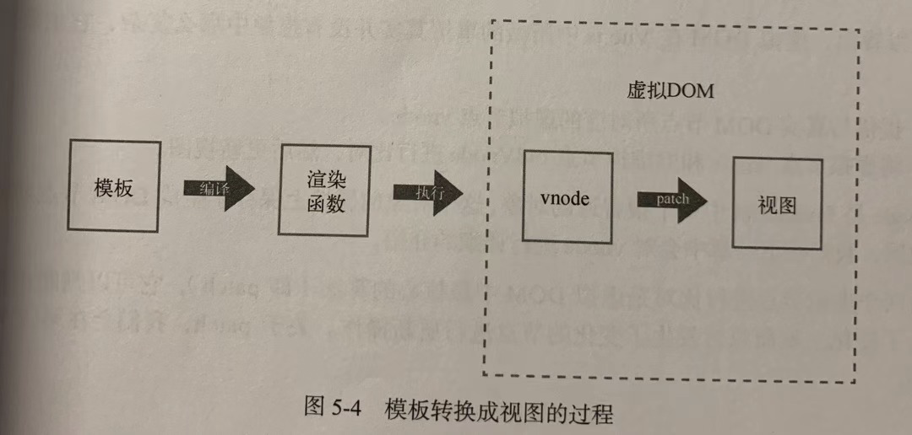
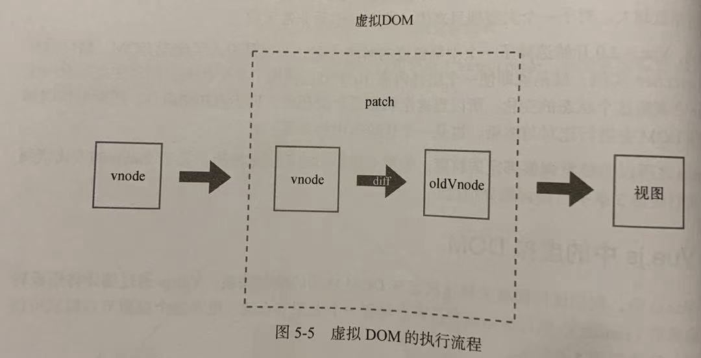

## 一、什么是虚拟 DOM

虚拟 DOM 是时代的产物，命令式操作 DOM 会使得代码不好维护。三大框架都是声明式地操作 DOM，我们通过描述状态和 DOM 之间的映射关系是怎样的，就可以将状态渲染成视图。

我们关注的应该是状态的维护，而不是 DOM 操作。

程序在运行时，状态会不断发生变化，我们怎么只更新变化的节点呢？

Angular 使用的是脏检查的流程，React 使用虚拟 DOM，Vue1.0 通过细粒度的绑定。

虚拟 DOM 的解决方式是通过状态生成一个虚拟节点树，然后使用虚拟节点树进行渲染。在渲染之前，会使用新生成的虚拟节点树和上一次生成的节点树进行对比，只渲染不同的部分。

> 我们将状态作为输入，并生成 DOM 输出到页面上显示出来的过程叫做渲染。

## 二、为什么要引入虚拟 DOM

Angular 和 React 的变化侦测有一个共同点，那就是它们都不知道哪些状态变了。因此，就需要进行比较暴力的比对，React 是通过虚拟 DOM，Angular 是通过脏检查。

Vue 的变化侦测在一定程度上知道具体哪些状态发生了变化，这样就可以通过更细粒度的绑定来更新视图。意思就是，当状态发生变化时，Vue 知道哪些节点使用了这个状态，从而对这些节点进行更新操作，根本不需要比对，不过这只是在 Vue1.0。

因为粒度太细导致了性能问题，所以 2.0 采取了中等粒度，引入了虚拟 DOM，粒度从具体节点提升为某个组件，就是一个组件由一个 watcher 来观察。当状态发生变化时，通知到组件，组件内部通过虚拟 DOM 去进行比对与渲染。

## 三、Vue.js 中的虚拟 DOM

在 Vue.js 中，我们使用模板来描述状态与 DOM 之间的映射关系。Vue.js 通过编译将模板转换成渲染函数（render），执行渲染函数就可以得到一个虚拟节点树，使用这个虚拟节点树就可以渲染页面。

虚拟 DOM 的终极目标就是将虚拟节点渲染到视图上。在渲染之前，需要先进行比对：

主要做了两件事：

1. 提供与真实 DOM 节点所对应的虚拟节点 vnode；
2. 将虚拟节点 vnode 和旧虚拟节点 oldVnode 进行比对，然后更新视图。

vnode 是一个普通对象，存储了生成 DOM 节点需要的一些数据。

对两个虚拟节点进行比对是虚拟 DOM 中最核心的算法（patch）。