虚拟 DOM 最核心的部分是 patch，它可以将 vnode 渲染成真实的 DOM。

patch 也叫做 patching 算法，通过对比两个 vnode 之间的不同，找出这部分节点进行更新。

DOM 操作的执行速度远不如 js 的运算速度，所有把大量的 DOM 操作搬运到 js 中，用 patching 算法来最大限度减少 DOM 操作。

## 一、patch 介绍

对比两个 vnode 之间的差异只是手段，patch 的目的是修改 DOM 节点，也可理解为渲染视图。它不是暴力替换节点，而是在现有 DOM 上进行修改来达到渲染视图的目的。主要做三件事：

1. 创建新增的节点（什么情况下创建？插入到哪里？）
2. 删除已经废弃的节点（什么情况下删除？删除哪个节点？）
3. 修改需要更新的节点（什么情况下修改？修改哪个节点？）

**什么情况下新增节点？**

需要新增节点的情况有两种，第一种就是当 oldVnode 不存在而 vnode 存在时，这通常发生在首次渲染中。第二种是当 vnode 和 oldVnode 完全不是同一个节点时，这时候 oldVnode 就是一个被废弃的节点。这两种都需要使用 vnode 生成真实的 DOM 元素并将其插入到视图当中去，

**什么情况下删除节点？**

当一个节点只在 oldVnode 中存在时，需要将它从 DOM 中删除，因为渲染视图时是以 vnode 为标准，所以 vnode 中不存在的节点都属于被废弃的节点，需要从 DOM 中删除。

在新节点替换旧节点过程中，先将新创建的 DOM 节点插入到旧节点的旁边，然后再将旧节点删除。

什么情况下更新节点？

新增节点和删除节点时，两个虚拟节点是完全不同的。如果两个节点是同一个节点时，我们需要对它们进行比较细致的比对，然后对 oldVnode 在视图中所对应的真实节点进行更新。

---

所以整个 patch 的过程是这样的：当 oldVnode 不存在时，直接使用 vnode 渲染视图；当 oldVnode 和 vnode 都存在但不是同一个节点时，使用 vnode 创建的 DOM 元素替换旧的 DOM 元素；当 oldVnode 和 node 是同一个节点时，使用更详细的对比操作对真实 DOM 进行更新。

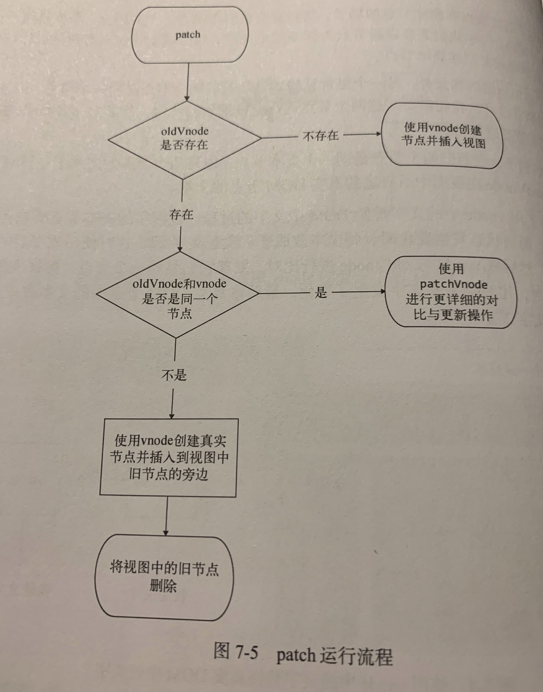

## 二、创建节点

一个元素从创建到渲染是怎样的？

创建一个真实 DOM 所需要的信息都在 vnode 中，我们通过它来创建 DOM 元素。vnode 是有类型的，我们要根据它的类型来创建出相同类型的 DOM 元素，然后将 DOM 元素插入到视图中。

事实上，只有三种类型的节点会被创建并插入到 DOM 中，元素节点、注释节点和文本节点。

首先根据是否具有 tag 属性判断是否是元素节点，

如果是的话，利用 document.createElement 来创建真实的元素节点，然后利用 appendChild 方法将它插入到指定的父节点中。

通常一个元素节点都会有子节点，所以当一个元素节点被创建后，我们需要将它的子节点也创建出来并插入到这个刚创建出的节点下面。这个过程是递归的过程，需要将 vnode 的 children 属性循环一遍，将每个子虚拟节点都执行一遍创建元素的逻辑。

如果不是元素节点则判断 isComment 来判断是注释节点还是文本节点，

如果是文本节点则利用 document.createTextNode 来创建真实的文本节点并将其插入到指定的父节点中。

如果是注释节点，

调用 document.createComment 方法来创建真实的注释节点并将其插入到指定的父节点中。

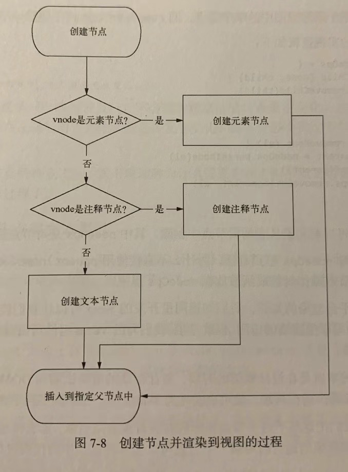

## 三、删除节点

一个元素是怎样从视图中删除的？

```jsx
function removeVnodes(vnodes, startIdx, endIdx) {
  for(; startIdx <= endIdx; ++ startIdx) {
    const ch = vnodes[startIdx]
    if(isDef(ch)) {
      removeVnode(ch.elm)
    }
  }
}
```

上面代码实现了删除 vnodes 数组中从 startIdx 指定的位置到 endIdx 指定位置的内容。

removeVnode 用于删除视图中的的单个节点，removeVnodes 用于删除一组节点。

```jsx
const nodeOps = {
	removeChild(node, child) {
		node.removeChild(child)
	}
}
function removeVnode(el) {
	const parent = nodeOps.parentNode(el)
	if(isDef(parent)) {
		nodeOps.removeChild(parent, el)
	}
}
```

上面代码是将当前元素从它的父节点中删除，nodeOps 是对节点操作的封装。

> 封装主要是为了跨平台使用。要让框架的渲染机制和 DOM 解耦，更新 DOM 时的节点操作进行封装，可实现跨平台，在不同平台下调用节点的操作。


## 四、更新节点

两个节点是同一个节点时，才需要更新元素节点。

第一步、判断静态节点：

在更新节点时，首先要判断新旧两个虚拟节点是否是静态节点，如果是就直接跳过更新过程。

> 静态节点是指那些一旦渲染到页面上之后，无论后面状态怎么变化，都不会发生变化的节点。


第二步、新虚拟节点有文本属性：

如果新生成的虚拟节点有 text 属性，直接调用 setTextContent（浏览器环境下是 node.textContent

）来将视图中 DOM 节点的内容改为虚拟节点的 text 属性所保存的文字。

第三步、新虚拟节点无文本属性：

如果新创建的虚拟节点无文本属性，说明它是一个元素节点。元素节点通常有子节点，也就是 children 属性，也可能没有，分为两种：

1. 新虚拟节点有 children 的情况
    - 旧虚拟节点有 children 属性
        
        需要进行更详细的对比并更新。更新 children 可能会移动某个子节点的位置，也可能会删除或者新增某个子节点。***（看第五点）***
        
    - 旧虚拟节点无 children 属性
        
        说明旧虚拟节点要么是一个空标签，要么是有文本的文本节点。如果是文本节点，那么要先把文本清空让它变成空标签，然后将新虚拟节点中的 children 挨个创建成真实的 DOM 元素节点并将其插入到视图中的 DOM 节点下面。
        
2. 新虚拟节点无 children 的情况
    
    当新创建的虚拟节点既没有文本属性也没有 children 属性，说明这个新创建的节点是一个空节点，它下面既没有文本也没有子节点。这时如果旧虚拟节点中有子节点就删除子节点，有文本就删除文本。直到为空标签。
    

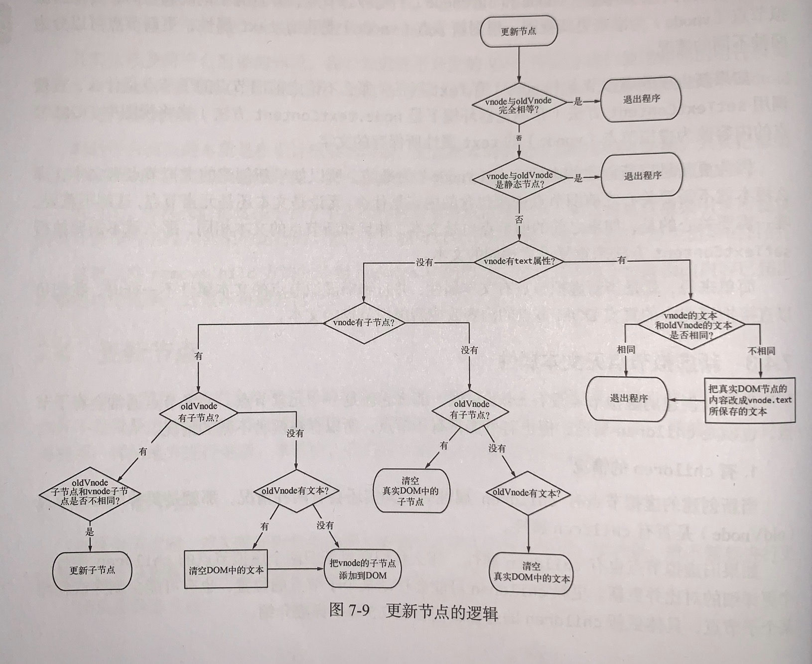

Vue 源码中真实的实现过程如下：

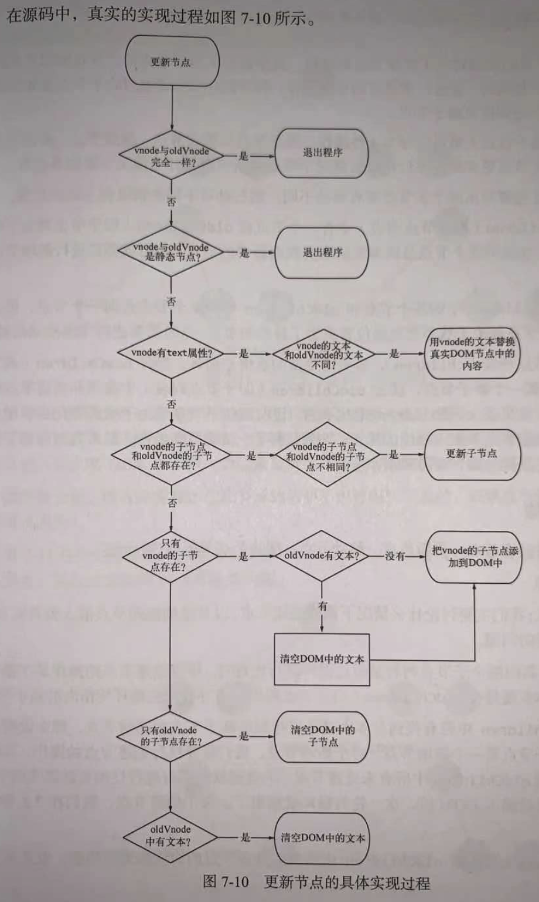

## 五、更新子节点

当新节点的子节点和旧节点的子节点都存在并且不相同时，会进行子节点的更新操作。

大致可分为四种：更新节点、新增节点、删除节点、移动节点位置。

更新节点就是对比两个节点不同，然后根据不同的情况做不同的处理。

对比节点，首先要进行循环。循环 newChildren（新子节点列表），每循环到一个新子节点，就去 oldChildren（旧子节点列表）中找到和当前节点相同的那个旧子节点。

如果找不到说明当前子节点是由于状态变化而新增的节点，我们要进行***创建节点并插入视图***的操作；如果找到了就做**更新操作**；如果找到的旧子节点的位置和新子节点不同，则需要移动节点。

### （一）更新策略

1. 创建子节点
    
    主要解决什么情况下需要创建节点，以及把创建的节点插入到 真实 DOM 中的哪个位置。
    
    因为新旧节点列表是通过循环进行比对的，所以创建节点的操作是在循环体内执行，具体实现是在 oldChildren 中寻找本次循环所指向的新子节点。
    
    如果在 oldChildren 中没有找到与本次循环所指向的新子节点相同的节点，那么说明本次循环所指向的新子节点是一个新增节点。
    
    对于新增节点，要执行创建节点的操作，并将新创建的节点插入到 oldChildren 中所有未处理节点（***就是没有进行任何更新操作的节点***）的前面。
    
    > 为什么插入到所有未处理节点的前面，而不是已处理节点的后面？
    因为我们是使用虚拟节点进行对比，真实 DOM 中已经处理的节点，除了包含旧虚拟 DOM 中已经处理的节点，还可能包含新插入的节点。所以我们根据 oldChildren 中的已处理节点去真实 DOM 中找位置去插入，可能会插入错误的位置。如下：
    
    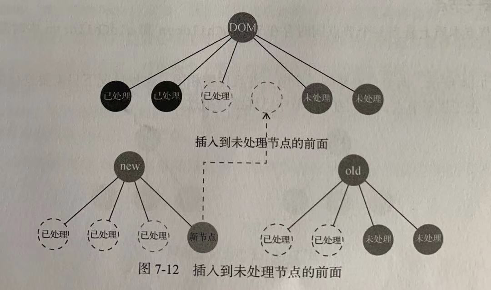
    
    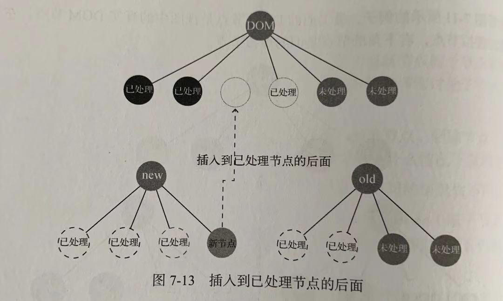
    
    当节点成功插入到 DOM 后，这一轮的循环就结束了。
    
2. 更新子节点
    
    更新节点本质上是当一个节点同时存在于 newChildren 和 oldChildren 中时需要执行的操作。
    
    可查看《四、更新节点》。
    
    但如果 oldChildren 中子节点的位置和本次循环所指向的新子节点的位置不一致时，除了更新操作之外还需要进行移动操作。
    
3. 移动子节点
    
    移动操作通常发生在 newChildren 中的某个节点和 oldChildren 中的某个节点是同一个节点但是位置不同，所以在真实的 DOM 中需要将这个节点以新虚拟节点的位置为基准进行移动（通过 Node.insertBefore( )方法）。
    
    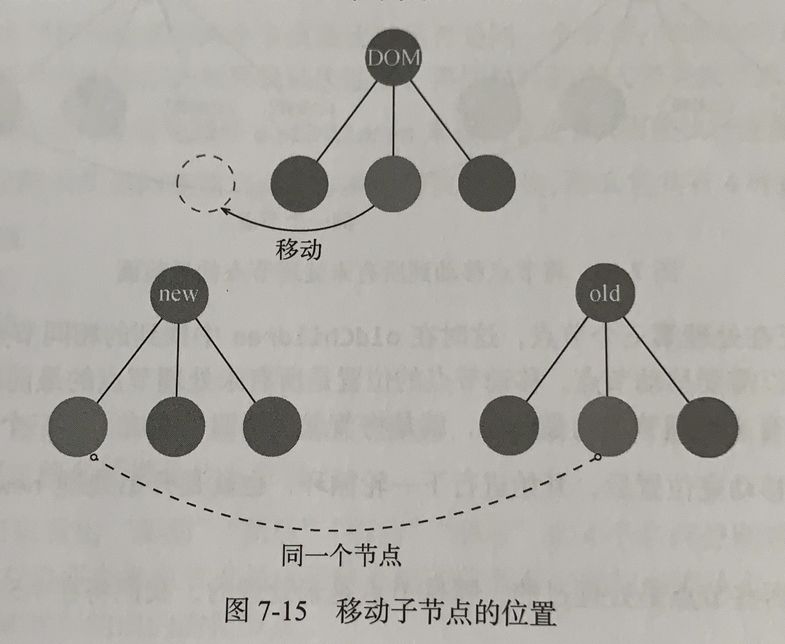
    
    > 怎么知道应该把节点移动到哪里？
    > 对比两个子节点列表是通过从左到右循环 / 这个列表，然后每循环一个节点，就去 oldChildren 中寻找与这个节点相同的节点进行处理。也就是说 newChildren 中当前被循环到的这个节点的左边都是被处理过的，那这个节点的位置就是所有未处理节点的第一个节点。
    
    
    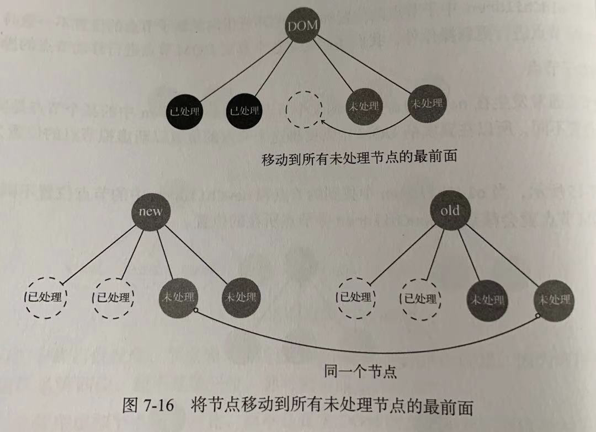
    
    节点更新并且移动完位置后，开始进行下一轮循环，也就是开始处理 newChildren 的下一个节点。
    
4. 删除子节点
    
    本质上是删除那些 oldChildren 中存在但 newChildren 中不存在的节点。
    
    当 newChildren 中的所有节点都被循环了一遍后，如果 oldChildren 中还有剩余节点没有被处理，那么这些节点就是被废弃、需要删除的节点。
    

### （二）优化策略

通常情况下，一个列表中会有几个节点的位置是不需要移动的。针对这些位置不变或者位置可预测的节点，不需要循环来查找。我们可以尝试使用相同位置的两个节点来比对是否是同一个节点，如果刚好是，就可以跳过循环查找直接进入节点的更新操作。如果尝试失败，再用循环的方式查找节点。

> 这种方式称为快捷查找，这样做可以很大程度避免循环 oldChildren 来查找节点，从而提升执行速度。

快捷查找一共有四种方式：

- 新前与旧前（newChildren 中所有未处理节点的第一个节点）
- 新后与旧后（newChildren 中所有未处理节点的最后一个节点）
- 新后与旧前（oldChildren 中所有未处理节点的第一个节点）
- 新前与旧后（oldChildren 中所有未处理节点的最后一个节点）

举个例子：

新前与旧前，指的是尝试使用“新前”与“旧前”对比，如果是同一个节点，说明我们不需要循环 oldChildren 就直接拿到了这个虚拟节点，直接执行节点的更新操作。

如果不是同一个节点，继续尝试剩下的三种方式，如果都没找到再去循环 oldChildren 查找。

***注意：***

- 新前与旧前、新后与旧后，是两个节点位置相同的查找方式，所以只需要执行节点的更新操作，不需要执行移动操作。
- “新后” 与 “旧前” 如果是同一个节点，在真实 DOM 中除了做更新操作外，还需要将节点（“旧前”）移动到所有未处理节点的最后面。
    
    > 为什么移动到最后面？
    > 因为“新后”这个节点是未处理节点的最后一个节点，所以在真实 DOM 中移动时，需要将旧前这个节点移动到所有未处理节点的最后面，才能与“新后”这个节点的位置相同。
    
    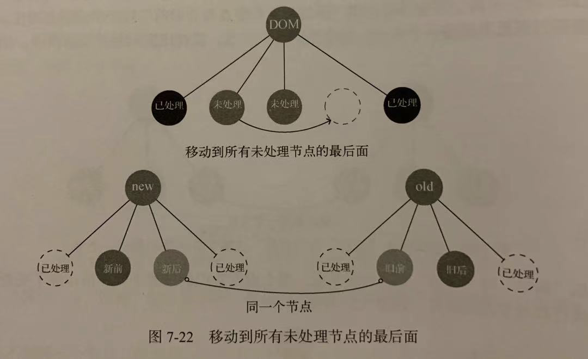
    
- 同理，“新前” 与 “旧后” 如果是同一个节点，在真实 DOM 中除了做更新操作外，还需要将节点（“旧后”）移动到所有未处理节点的最前面。
    
    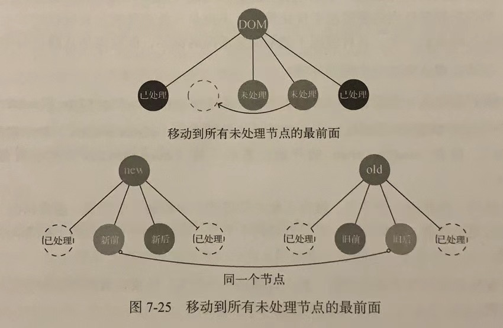
    

### （三）哪些节点是未处理过的

因为我们的处理逻辑都是在循环体内执行的，所以只要让循环条件保证只有未处理过的节点才能进入循环体内，就能达到忽略已处理过的节点。

本来我们查找节点是以新虚拟节点为基准，去循环旧虚拟节点从前向后遍历查找，但由于查找的性能问题，我们采用了四种快捷查找方式。节点有可能会从后面对比的，这就说明我们不能从前向后循环了，而应该是从两边向中间循环。

怎么实现两边向中间循环？

1. 准备四个变量：
    - oldStartIdx（oldChildren 的开始位置）
    - oldEndIdx（oldChildren 的结束位置）
    - newStartIdx（newChildren 的开始位置）
    - newEndIdx（newChildren 的结束位置）
2. 在循环体内，每处理一个节点，就将下标向指定的位置移动一个位置；
    
    通常是对新旧两个节点进行更新操作，相当于一次性处理两个节点。开始位置所表示的节点被处理后，就向后移动一个位置；结束位置的节点被处理后，就向前移动一个位置。
    
3. 当开始位置大于结束位置时，说明节点都遍历过了，则结束循环。
    
    ```jsx
    while(oldStartIdx <= oldEndIdx && newStartIdx <= newEndIdx){
    	...
    }
    ```
    
    > 当新旧节点的节点数量不一致时，会导致循环结束后还有一部分未处理的节点。这样反而可以少循环几次，提升一些性能。
    如果是 oldChildren 先循环完毕，说明 newChildren 中剩余的节点都是需要新增的节点，可直接将这些节点插入到 DOM 中，无需循环对比。
    如果是 newChildren 先循环完毕，说明 oldChildren 中剩余的节点都是需要被删除的。
    

**下面是更新子节点的整体流程：**

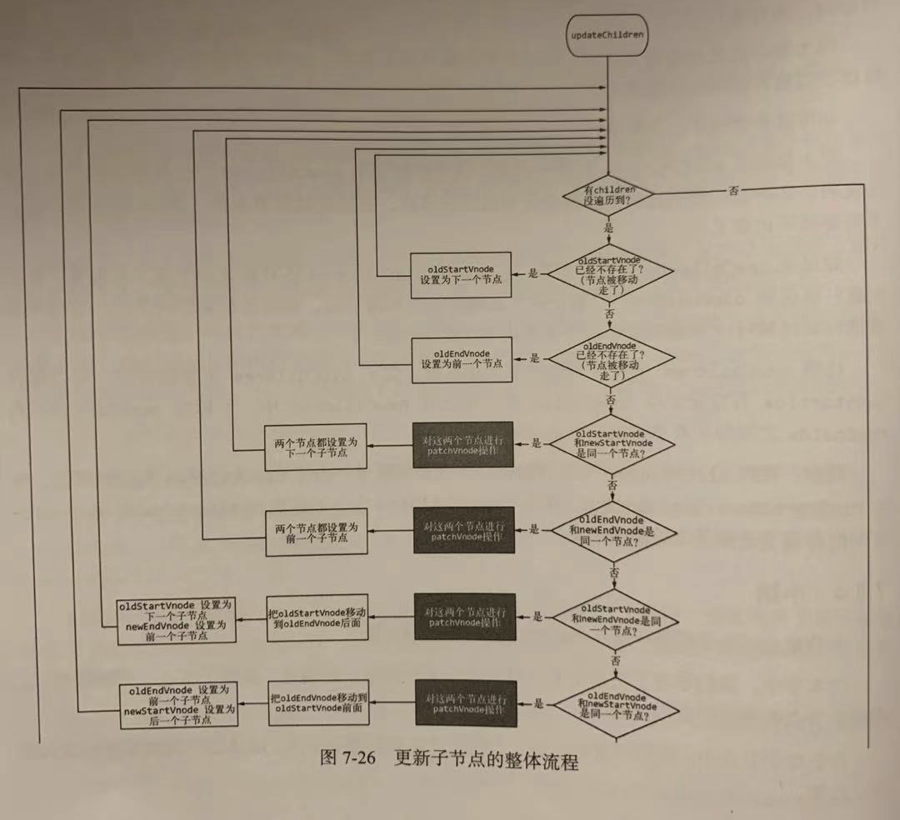

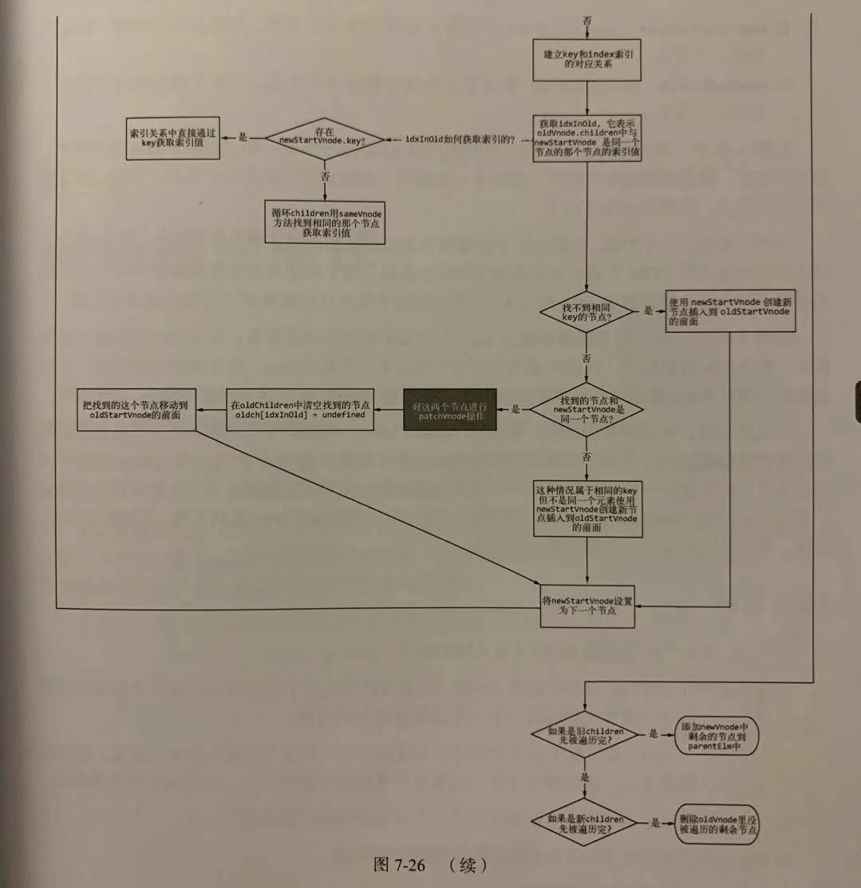

在图中，一开始先判断 oldStartVnode 和 oldEndVnode 是否存在，如果不存在直接跳过本次循环，主要是为了处理旧节点已经被移动到其他位置的情况。真正移动的是真实 DOM 节点，移动真实 DOM 节点后，为了防止后续重复处理同一个节点，旧的虚拟节点会被设置为 undefined，标记该节点已被处理并且移动到其他位置。

图中 建立 key 与 index 索引的对应关系？

如果在模板中渲染列表时，我们为节点设置了属性 key，那么在建立 key 与 index 索引的对应关系时，就生成了一个 key 对应着一个节点下标这样一个对象。也就是说，如果我们设置了 key，那么在oldChildren 中查找相同节点时，可以直接通过 key 拿到下标，从而获取节点。这样的话，根本就不需要通过循环来查找节点了。。