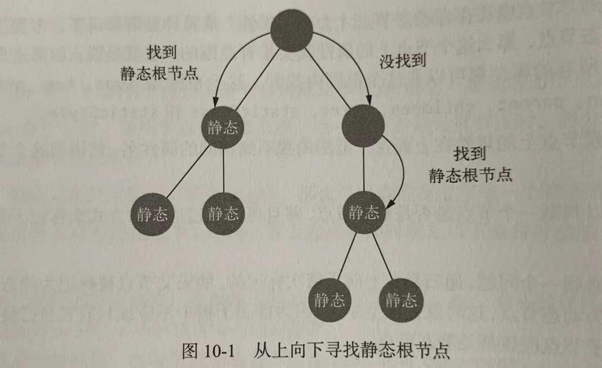

优化器的作用是在 AST 中找出静态子树并打上标记。标记静态子树有两点好处：

1. 每次重新渲染时，不需要为静态子树创建新节点；
2. 在虚拟 DOM 中打补丁（patching）的过程可以跳过。

优化器的内部实现主要分为两个步骤：

1. 在 AST 中找出所有静态节点并打上标记；
2. 在 AST 中找出所有静态根节点并打上标记；

先标记静态节点，再标记所有静态根节点。

什么是静态节点？

不会发生变化的节点属于静态节点，

> 落实到 AST 中，静态节点指的就是 static 属性为 true 的节点。


什么是根静态节点？

如果一个节点下面的所有子节点都是静态节点，并且它的父级是动态节点，那么它就是静态根节点。

> 落实到 AST 中，静态根节点指的是 staticRoot 属性为 true 的节点。


## 一、找出所有静态节点并标记

从根节点开始，先判断根节点是不是静态根节点，再用相同的方式处理子节点，接着用同样的方式处理子节点的子节点，即递归处理。

下面是处理的函数：

```jsx
function markStatic(node) {
	node.static = isStatic(node)
	if(node.type === 1) {
		for(let i = 0,l = node.children.length; i < 1; i++) {
			const child = node.children[i]
			markStatic(child)
		
			if(!child.static) {
				node.static = false
			}
		}
	}
}
function isStatic(node) {
	if(node.type === 2) { // 带变量的动态文本节点
		return false 
	}
	if(node.type === 3) { // 不带变量的纯文本节点
		return true
	}
	return !!(node.pre || (
		!node.hasBindings && // 没有动态绑定
		!node.if && !node.for && // 没有 v-if 或 v-for 或 v-else
		!isBuiltInTag(ndoe.tag) && // 不是内置标签
		isPlatformReservedTag(node.tag) && // 不是组件
		!isDirectChildOfTemplateFor(node) && 
		Object.keys(node).every(isStaticKey)
	))
}
```

如果 type = 1，说明是一个元素节点。

首先判断元素节点使用了指令 v-pre，那么断定它是一个静态节点。

如果没有使用 v-pre，需要满足下面的条件才会认为是一个静态节点：

- 不能使用动态绑定语法，即以 v-、@、: 开头的属性
- 不能使用 v-if、v-for 或者 -else 指令
- 不能是内置标签，即标签名不能是 slot 或者 component
- 不能是组件，即标签名必须是保留标签
- 当前节点的父节点不能是带 v-for 指令的 template 标签
- 节点中不存在动态节点才会有的属性

递归是从上向下一次标记的，如果父节点被标记为静态节点之后，子节点却被标记为动态节点，这时会发生矛盾，因为静态子树的所有子节点应该都是静态节点，所以可以重新校对一下：

```jsx
function markStatic(node) {
	node.static = isStatic(node)
	if(node.type === 1) {
		for(let i = 0,l = node.children.length; i < 1; i++) {
			const child = node.children[i]
			markStatic(child)
		
			// 新增校对
			if(!child.static) {
				node.static = false
			}
		}
	}
}

```

## 二、找出所有静态根节点并标记

标记完静态节点之后要标记静态根节点

寻找静态根节点也是自上而下递归去找，如果一个节点被判定为静态根节点，那么不会继续向它的子级继续寻找，因为静态子树肯定只有一个根，就是最上面的静态节点。



大部分情况下，我们找到的第一个静态节点会被标记为静态根节点，除了一种情况，就是这个元素节点只有一个文本节点，这种情况不会认为这个元素节点是静态节点，因为其优化成本将超过收益，所以它不会被标记为静态根节点。

```jsx
function markStaticRoots(node) {
	if( node.type === 1) {
		if(node.static && node.children.length && !(
			node.children.length === 1 && 
			node.children[0].type === 3
		)) {
			node.staticRoot = true
			return
		} else {
			node.staticRoot = false
		}
		if(node.children) {
			for(let i = 0, l = node.children.length; i++) {
				markStaticRoots(node.children[i])
			}
		}
	}
}
```

上面代码一部分是标记当前节点是否是静态根节点，另一部分是标记子节点是否是静态根节点。